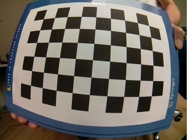
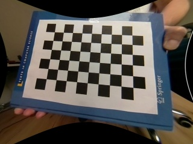

# Connected Robot

Robot based on https://github.com/apichlkostner/robot

Additional HW: Raspberry Pi 3, fish eye lens camera

## HW nodes

* Desktop PC
* Raspberry Pi 3
* uC board

## Sensors

* Camera
* IR distance sensors
* motor encoders

## Connectivity

* ROS, ROSSerial
* LAN
* WLAN
* UART

## ROS nodes

* roslaunch script to launch all nodes on Desktop, Raspberry Pi and uC board
* Low level on uC board 
    * IR sensors
    * wheel encoders
    * motor driver
* Application on Raspberry Pi 3
    * camera publisher node
    * joystick to motor driver
* Performance and user interaction on desktop
    * camera viewer
    * joystick driver node

## Camera calibration

Camera calibration and undistortion for fish eye lens camera is done with OpenCV:

