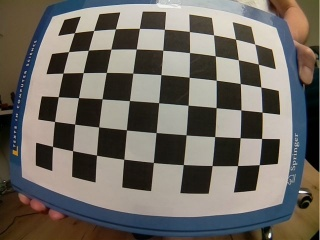
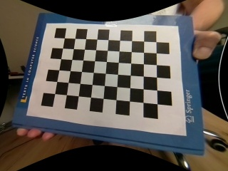

# Connected robot application (Linux nodes)

## Viewer for the camera images and image processing

Node: show_robot_camera_gui

Two threads, one ROS event loop and one Qt GUI event loop.

### Qt event loop: mainwindow

Shows the processed image from the ROS node

### ROS event loop: show_robot_camera_node

Subscribes to camera image topic and IR distance sensor topic.

Visualizes the distances on the image and emits the result to the Qt event loop.

## Joystick node

Implemented as Python script: joystick_node.py

Subscribes the joystick topic and sends corresponding control commands to the robot.

## Launch files

Launch all nodes on robot and desktop: start_all.launch

## Helper code

### Camera calibration

Offline fish eye camera calibration in CameraCalibration.py

Values are manually copied to viewer node code.

### Camera image viewer script

Python script show_robot_camera_node.py

A bit too slow even without processing -> C++ implementation see above